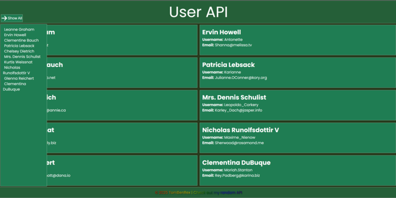

 

:point_right:<a href="https://tombenrex.github.io/User-API/" target="blank">Live Server</a> :point_left:

##

<h1 align="center">Hi 👋, I'm Tom Larsson</h1>
<h3 align="center">An upcoming frontend developer from Sweden</h3>

  

- 🌱 I’m currently learning **HTML, Javascript, CSS, React**

- 📫 How to reach me **92tomlar@skola.boras.se**

- ⚡ Fun fact **Started build houses now building webpages**

<h3 align="left">Connect with me:</h3>

<h3 align="left">Languages and Tools:</h3>

    

# Om uppgiften

I denna uppgift ska du skapa en hemsida som hämtar användardata från ett API och visar den på sidan. Du kommer att använda JavaScript för att hämta data via `fetch`-metoden och visa den på en webbplats designad med HTML och CSS. Uppgiften kräver att du implementerar en användarvänlig och responsiv design.
# Vad du ska göra

### 1. **Testa URL med ett verktyg som Postman eller annat**

- För att förstå hur datan ser ut och vilket format den har, börja med att testa API:et med hjälp av ett verktyg som **Postman** eller något annat API-testverktyg.
- Använd URL:en `https://jsonplaceholder.typicode.com/users` för att se användardata i JSON-format.
- Detta hjälper dig att få en uppfattning om strukturen på datan och vilken information som finns tillgänglig.

### 2. **Visa användardata**

- Från den hämtade användardatan, visa följande information direkt på sidan:
    - **Name** (Användarens namn)
    - **Username** (Användarnamn)
    - **Email** (Användarens e-postadress)

### 3. **Knapp för att visa mer information**

- Lägg till en knapp som när den klickas på visar mer detaljer om användaren, som:
    - **City** (Stad)
    - **Phone** (Telefonnummer)
    - **Company name** (Företagsnamn)

### 4. **Design**

- Din design ska vara **tydlig och läsbar**. Tänk på användarupplevelsen och se till att texten är lätt att läsa och att sidan har ett rent och enkelt utseende.
### 5. **Responsiv design**

- Din design måste vara **responsiv**, vilket betyder att den ska fungera bra på både stora skärmar (som datorer) och mindre skärmar (som mobiler och surfplattor).
- Använd CSS-media queries eller flexbox/grid för att anpassa layouten efter olika skärmstorlekar.

### 6. **Val av layout**

- Du kan välja att visa användardatan som en **tabell**, **kort** (cards), **lista** eller någon annan layout som passar bäst för informationen. Det är viktigt att presentationen är överskådlig och lätt att följa.

### 7. **Använd minst två JavaScript-funktioner**

- Du måste använda **minst två JavaScript-funktioner**. Till exempel kan du skapa en funktion för att hämta data och en annan för att visa mer information när användaren klickar på knappen.

### 8. **Designval**

- Du kan själv välja färger, navigeringsmeny (navbar) och footer. Anpassa designen för att göra sidan mer attraktiv och användarvänlig.

### 9. **Använd semantiska HTML-taggar**

- Du måste använda **semantiska taggar i HTML**, som `<header>`, `<footer>`, `<section>`, `<article>`, och andra relevanta taggar för att skapa en strukturerad och lättförståelig HTML.

### **Beskrivning av funktionaliteten**

- **Datahämtning via API**: Du ska använda `fetch` i JavaScript för att hämta användardata från URL:en `https://jsonplaceholder.typicode.com/users`. Denna data kommer att vara i JSON-format.
- **Visning av användardata**: På sidan ska du visa användarens namn, användarnamn och e-postadress i början. När användaren klickar på en knapp ska mer detaljerad information visas, såsom stad, telefonnummer och företagsnamn.
- **Interaktivitet**: Använd knappen för att växla mellan att visa grundläggande användardata och detaljerad användardata. Detta kan göras med JavaScript-funktioner för att hantera visningen av extra information.
- **Responsiv layout**: Se till att din layout anpassar sig bra till olika skärmstorlekar. Din design bör vara funktionell och användarvänlig på alla enheter.
